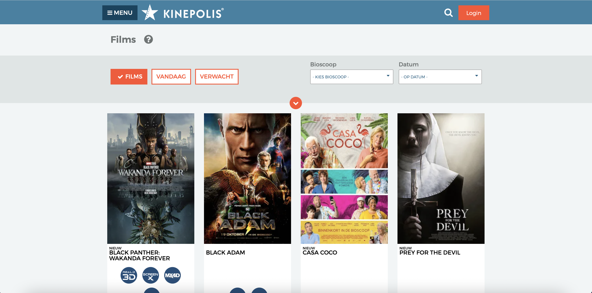
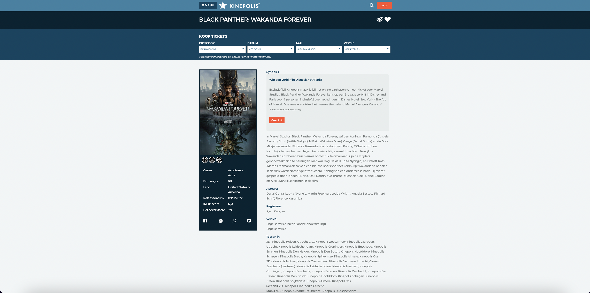
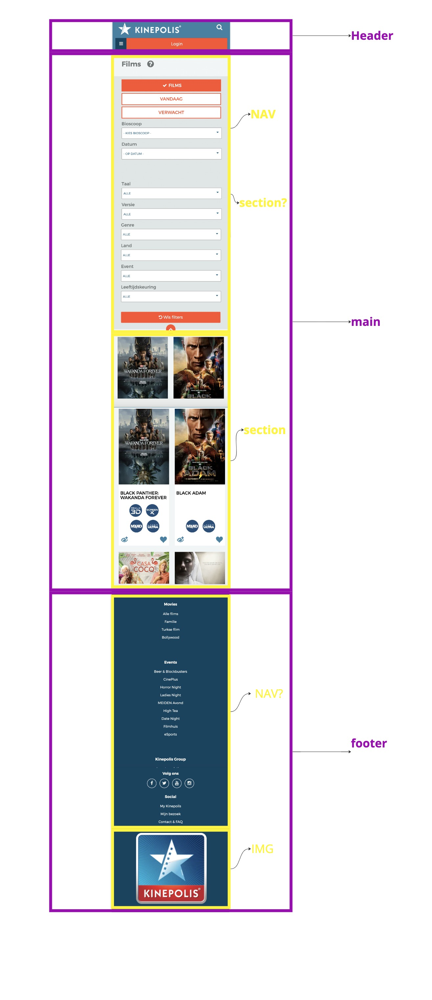
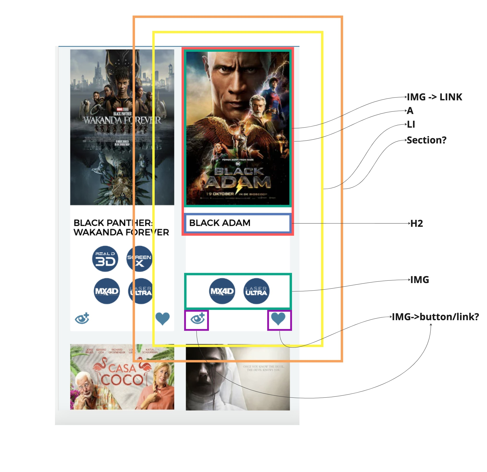
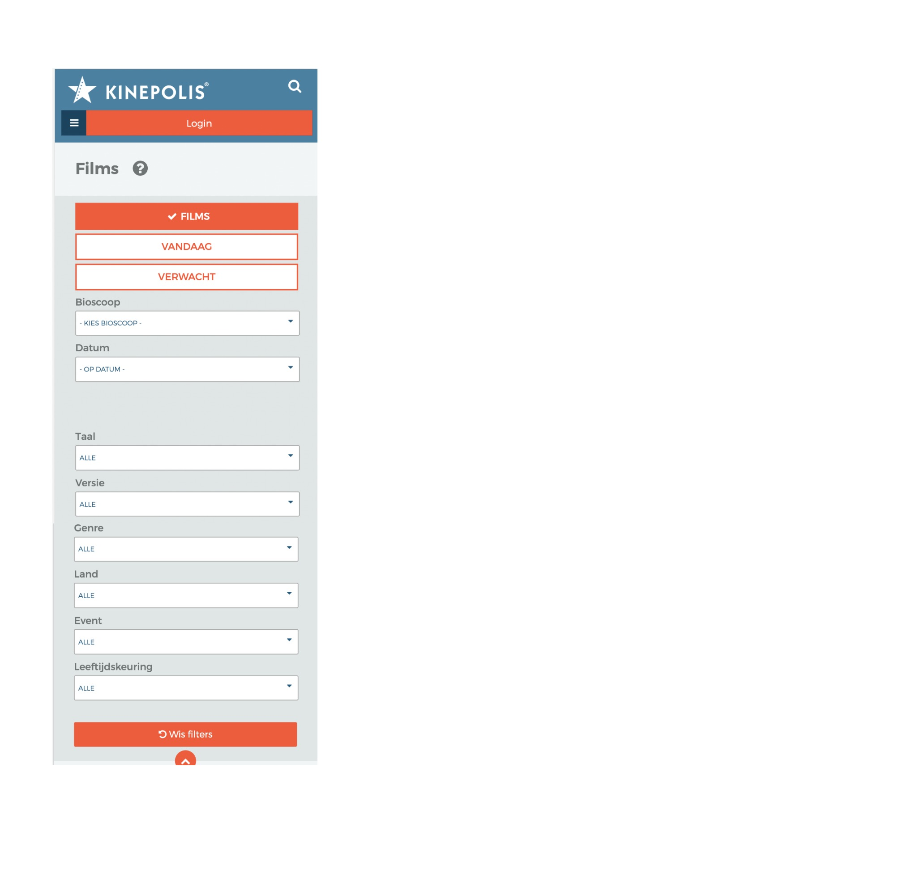
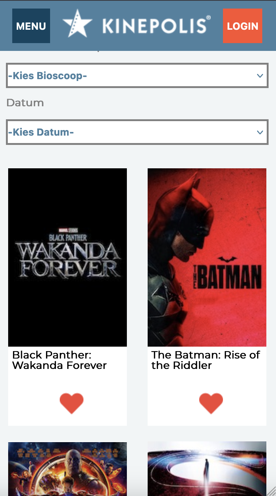
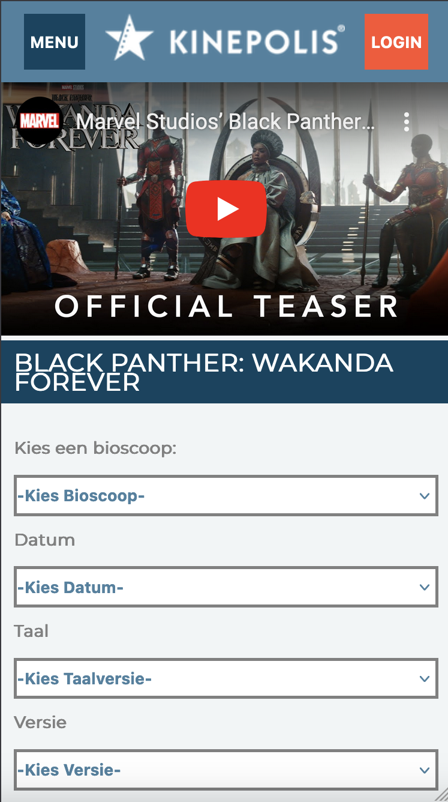
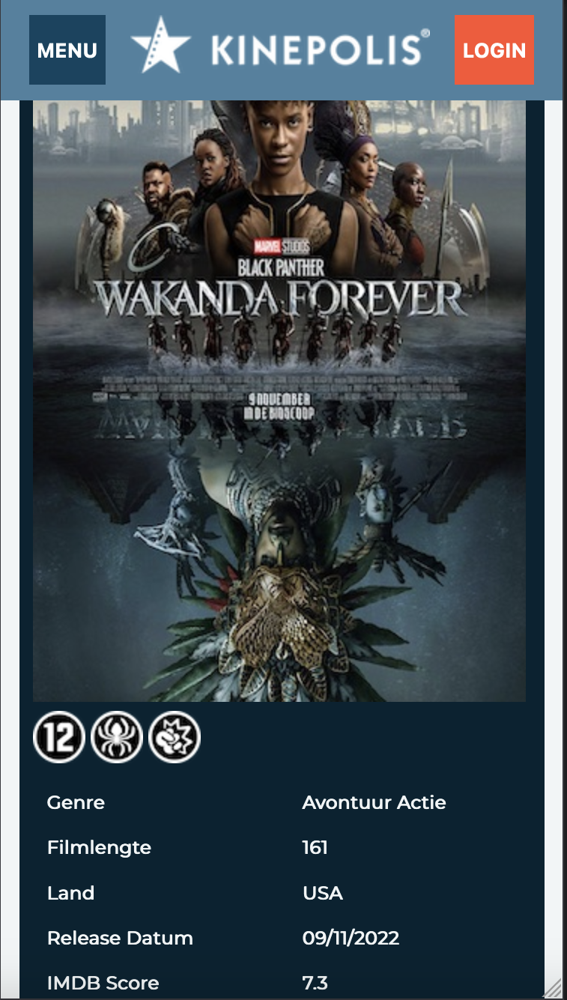
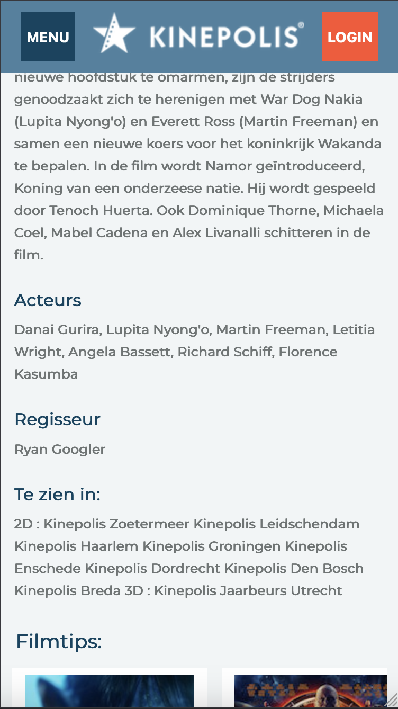
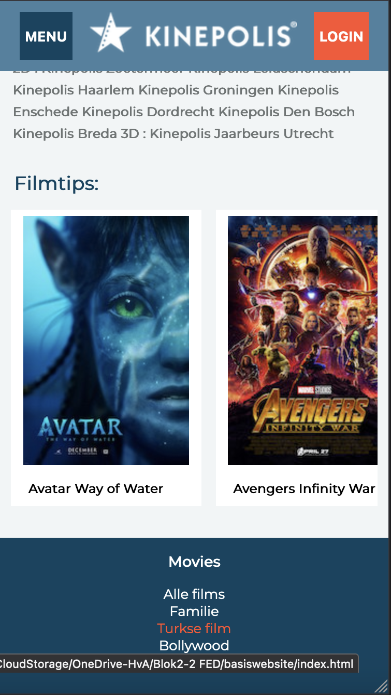

# Procesverslag
Markdown is een simpele manier om HTML te schrijven.  
Markdown cheat cheet: [Hulp bij het schrijven van Markdown](https://github.com/adam-p/markdown-here/wiki/Markdown-Cheatsheet).

Nb. De standaardstructuur en de spartaanse opmaak van de README.md zijn helemaal prima. Het gaat om de inhoud van je procesverslag. Besteedt de tijd voor pracht en praal aan je website.

Nb. Door *open* toe te voegen aan een *details* element kun je deze standaard open zetten. Fijn om dat steeds voor de relevante stuk(ken) te doen.

## Jij

  
uitwerken voor kick-off werkgroep

  ### Auteur:
  Ryan Hillert

  #### Je startniveau:
  Blauw

  #### Je focus:
  Surface Plane
 

## Je website

  
uitwerken voor kick-off werkgroep

  ### Je opdracht:
  https://kinepolis.nl/?main_section=films

  #### Screenshot(s) van de eerste pagina (small screen): 
  Overzichtspagina  
  

  #### Screenshot(s) van de tweede pagina (small screen):
  Detailpagina  
  
 

## Toegankelijkheidstest 1/2 (week 1)

  
uitwerken na test in 1e werkgroep

  ### Bevindingen
  Lijst met je bevindingen die in de test naar voren kwamen:

  #### Screenreader
  • Je kan naar het kopje bioscoop maar vervolgens worden alle bioscopen opgenoemd, en kan je eigenlijk geen bioscoop selecteren. 
	• Zelfde geldt voor datum, Je kan naar het kopje datum maar vervolgens worden er geen datums opgenoemd, en kan je eigenlijk geen bioscoop selecteren. 
	• Je kan de filters selecteren maar vervolgens niet echt een keuze maken tussen de filters
	• Tijdens het gebruiken van de tab toets gaat het steeds terug naar het menu waardoor je steeds elke keer het hele menu door moet om weer verder te gaan.
	• Als je dan eenmaal in het menu weer zit ga je steeds van kopje naar kopje zonder enige aankondiging.

  Met behulp van een sematische goede code los je al de meeste problemen op.

  #### Muis en Toetsenbord 
  Hier korte omschrijving (met indien nodig afbeeldingen)

  Hier een omschrijving van hoe het opgelost kan worden (met indien nodig afbeeldingen)

  #### Motoriek (shocks, elastiekjes)
  Hier korte omschrijving (met indien nodig afbeeldingen)

  Hier een omschrijving van hoe het opgelost kan worden (met indien nodig afbeeldingen)

  #### Visueel (brillen, contrast, kleurenblind, dark/light). 
  Hier korte omschrijving (met indien nodig afbeeldingen)

  Hier een omschrijving van hoe het opgelost kan worden (met indien nodig afbeeldingen)

## Breakdownschets (week 1)

  
uitwerken na afloop 2e werkgroep

  ### de hele pagina: 
  

  ### dynamisch deel (bijv menu): 
  

  ### wellicht nog een dynamisch deel (bijv filter): 
  

## Voortgang 1 (week 2)

  
uitwerken voor 1e voortgang

  ### Stand van zaken
  hier dit ging goed & dit was lastig (neem ook screenshots op van delen van je website en code)

  ### Agenda voor meeting
  samen met je groepje opstellen

    Charity :
  - is een Hamburg menu nodig? Of mag ik ook een normale nav maken?
  - hoe werken slide shows?
  - mag je gebruik maken van sections om verschillende delen van je website aan te geven?

    Matthew:
  - moet je phone versie ook horizontaal werken?
  - moet je alle animaties ook overnemen van je site?

  Quinty:
    - Hoe is mijn gebruik van classes en divs? Is dit de juiste manier? Hoe zou dit beter kunnen?
    - Heb ik position te vaak gebruikt? Is dit de juiste manier? Hoe zou dit beter kunnen?
    - Ik heb veel margin en padding veranderingen gebruikt om te positioneren, is dit handig? Hoe zou dit beter kunnen?

  Ryan:
  - Hoe kan ik het beste de filters opties toevoegen?  
  - Hele section van de film klikbaar maken?
  - Hoe je een makkelijkere navigatie menu kan maken inplaats van hamburger menu

  ### Verslag van meeting
  hier na afloop snel de uitkomsten van de meeting vastleggen

  - punt 1
  - punt 2
  - nog een punt
  - ...

## Voortgang 2 (week 3)

  
uitwerken voor 2e voortgang

  ### Stand van zaken
  hier dit ging goed & dit was lastig (neem ook screenshots op van delen van je website en code)

  ### Agenda voor meeting
  samen met je groepje opstellen

  | student 1      | student 2          | student 3    | student 4        |
  | ---            | ---                | ---          | ---              |
  | dit bespreken  | en dit             | en ik dit    | en dan ik dat    |
  | en dat ook nog | dit als er tijd is | nog een punt | dit wil ik zeker |
  | ...            | ...                | ...          | ...              |

  ### Verslag van meeting
  hier na afloop snel de uitkomsten van de meeting vastleggen

  - punt 1
  - punt 2
  - nog een punt
- ...

## Toegankelijkheidstest 2/2 (week 4)

  
uitwerken na test in 8e werkgroep

  ### Bevindingen
  Lijst met je bevindingen die in de test naar voren kwamen (geef ook aan wat er verbeterd is):

  #### Screenreader
  Hier korte omschrijving (met indien nodig afbeeldingen)

  Hier een omschrijving van hoe het opgelost kan worden (met indien nodig afbeeldingen)

  #### Muis en Toetsenbord 
  Hier korte omschrijving (met indien nodig afbeeldingen)

  Hier een omschrijving van hoe het opgelost kan worden (met indien nodig afbeeldingen)

  #### Motoriek (shocks, elastiekjes)
  Door shocks werd het erg moeilijk om op dingen te klikken. Bij mij merkte ik dat ook.

  Ik he  dit kunnen oplossen door de sommige knoppen iets groter te maken.

  #### Visueel (brillen, contrast, kleurenblind, dark/light). 
  Kwa kleuren was er al niet veel mis op de originele site. Ik heb mijn kleuren iets donkerder gemaakt en lichter gemaakt om toch een duidelijk verschil te laten zien.

## Voortgang 3 (week 4)

  
uitwerken voor 3e voortgang

  ### Stand van zaken
  hier dit ging goed & dit was lastig (neem ook screenshots op van delen van je website en code)

  ### Agenda voor meeting
  samen met je groepje opstellen

  | student 1      | student 2          | student 3    | student 4        |
  | ---            | ---                | ---          | ---              |
  | dit bespreken  | en dit             | en ik dit    | en dan ik dat    |
  | en dat ook nog | dit als er tijd is | nog een punt | dit wil ik zeker |
  | ...            | ...                | ...          | ...              |

  ### Verslag van meeting
  hier na afloop snel de uitkomsten van de meeting vastleggen

  - punt 1
  - punt 2
  - nog een punt
  - ...

## Eindgesprek (week 5)

  
uitwerken voor eindgesprek

  ### Je uitkomst - karakteristiek screenshots:
  
  
  
  
  

  ### Dit ging goed/Heb ik geleerd: 
  Korte omschrijving met plaatjes

  

  ### Dit was lastig/Is niet gelukt:
  Korte omschrijving met plaatjes

  

## Bronnenlijst

  
continu bijhouden terwijl je werkt

  Nb. Wees specifiek ('css-tricks' als bron is bijv. niet specifiek genoeg).

  1. https://www.themoviedb.org/t/p/original/6Ju1pPOWuTprBmeZe2oVFgn3MOP.jpg 
  2. https://media-cache.cinematerial.com/p/500x/oc7qsbxd/the-batman-movie-poster.jpg?v=1604176909
  3. https://www.blackfilm.com/read/wp-content/uploads/2018/03/Avengers-Infinity-War-new-poster.jpg
  4. https://3.bp.blogspot.com/-k2ix_B3n4hU/UZfXZJyuP5I/AAAAAAAAciE/mlVdC5h0WeU/s1600/Man+of+Steel+Theatrical+One+Sheet+Movie+Poster.jpg
  5. https://media.senscritique.com/media/000016312185/source_big/american_psycho.jpg
  6. https://cdn.traileraddict.com/content/20th-century-fox/avatar-way-of-water.jpg
  7. https://picfiles.alphacoders.com/174/174329.jpg
  8. https://www.inspirationde.com/image/104451/
  9. https://www.blackfilm.com/read/wp-content/uploads/2014/05/Guardians-of-the-Galaxy-poster-2.jpg
  10. https://image.tmdb.org/t/p/original/btM7n4I7qXdMMiYJ4WZGh4SRuWt.jpg
  11. https://image.tmdb.org/t/p/original/btM7n4I7qXdMMiYJ4WZGh4SRuWt.jpg

